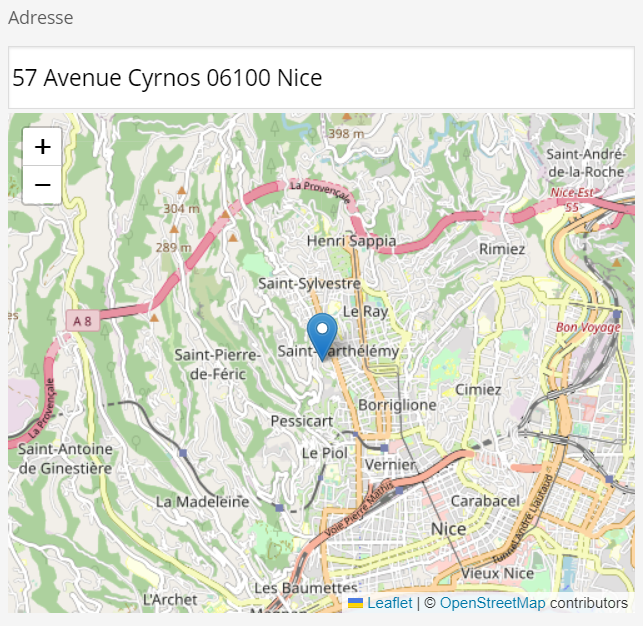

# sevengroupfrance/sulu-fr-gouv-map-bundle

\
Inspired by [this pull request](https://github.com/sulu/sulu-demo/pull/66).

## What is this bundle's goal?

To create a new content type `adresse` which is a single text input with autocomplete. It only searches through french addresses
since it uses the [data gouv API](https://adresse.data.gouv.fr/api-doc/adresse).\
The map installed in this bundle comes from [React Leaflet JS](https://react-leaflet.js.org/).

## Installation
1. Download the [package](https://packagist.org/packages/sevengroupfrance/sulu-fr-gouv-map-bundle) in your project with the following command line:\
`composer require sevengroupfrance/sulu-fr-gouv-map-bundle`.
2. In `config/bundles.php` add the following code:\
`SevenGroupFrance\SuluFrGouvMapBundle\SuluFrGouvMapBundle::class => ['all' => true]`.
3. In `assets/admin/package.json`, add the following line in the "dependencies" object:\
`"sulu-fr-gouv-map-bundle": "file:node_modules/@sulu/vendor/sevengroupfrance/sulu-fr-gouv-map-bundle/src/Resources/js"`.
4. In `assets/admin`, `npm install` to initialize the bundle's symlink directory.
5. In the same folder, `npm i react react-dom leaflet` and then `npm i react-leaflet`.
6. In `assets/admin/index.js`, add this line:\
`import 'sulu-fr-gouv-map-bundle'`.
7. In `assets/admin`, `npm run watch` or `npm run build`

## Use in your template files
Once installed you'll have to create a new property with the type `adresse`
```
<property name="address" type="adresse">
  <meta>
    <title lang="en">address field (with autocomplete)</title>
  </meta>
</property>
```
